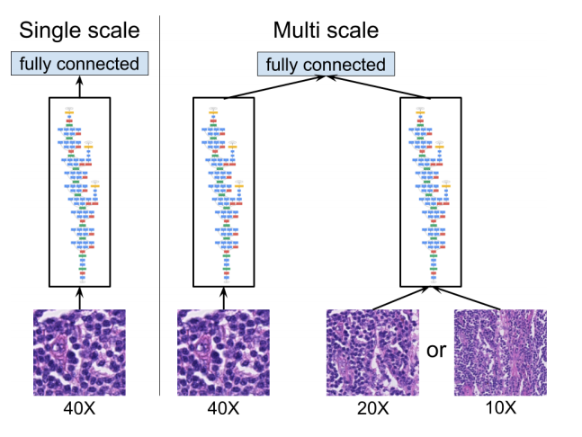
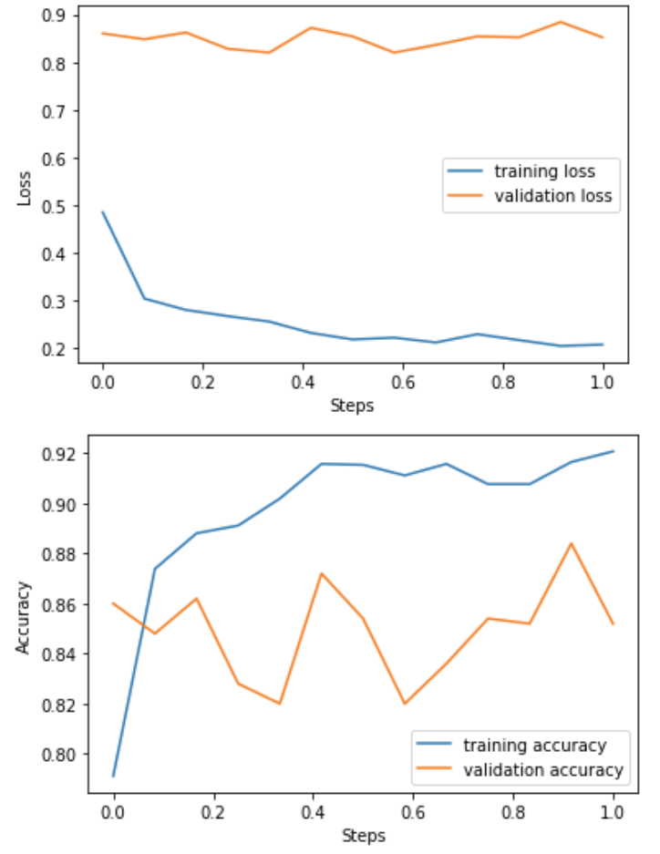
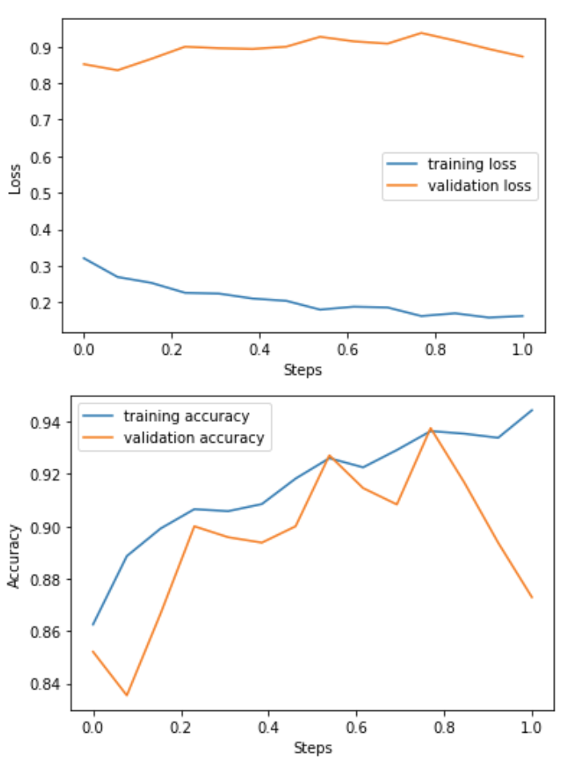
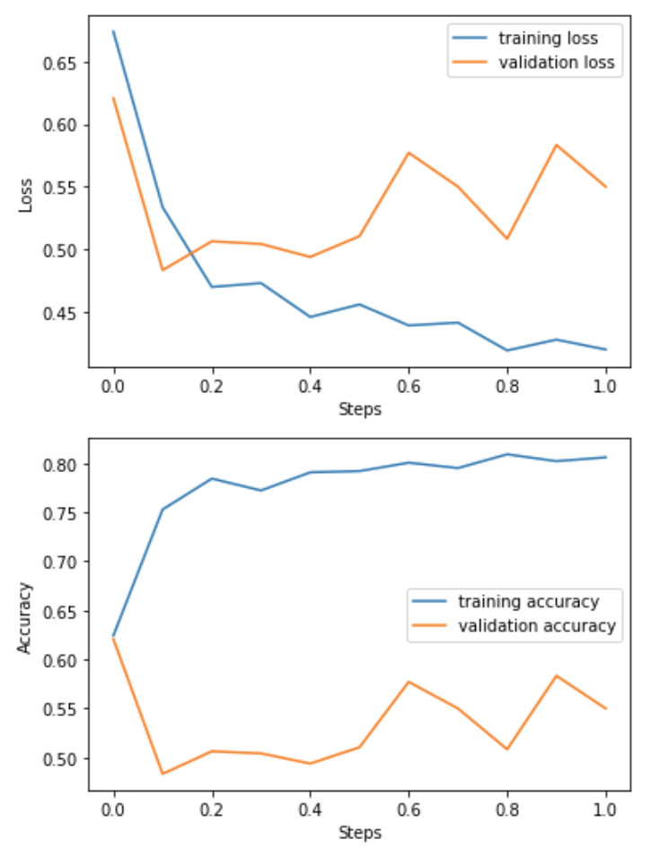

# Cancer Detection

>Applied Deep Learning Final Project

Zihe Wang, zw2624@columbia.edu

**Objectives**
------------
The main objective for this project is to develope a tool to assist physicians
* Given a collection of training data, develop a model that outputs a heatmap showing regions of a biopsy image likely to contain cancer.
* The output might act as an automatic second opinion
* The tool could reduce misdiagnosis at little cost

**Dataset**
------------
The dataset contains slides and tumor masks from the [CAMELYON16](https://camelyon17.grand-challenge.org/Data/) dataset. 

In total, I used 18 slides: 13 for training, 2 for validation and 3 for testing.

**Approach**
------------
I used patch based approach. For each slide, I extract patches and labels by sliding a window across it with following rules:
* extract only if the tissue in the patch is more than 30%
* extract the surrounding context at the same time
The following is a sample:

**Model**
------------
I tried two models as shown in paper[1]

For the transfer learning part, I used an Inception (V3) architecture.

**Result**
------------

The loss and accuracy of training and validation 

single input             |  two inputs (InceptionV3)         |  two inputs (VGG)
:-------------------------:|:-------------------------: |:-------------------------: 
   |   | 

**Reference**
------------
