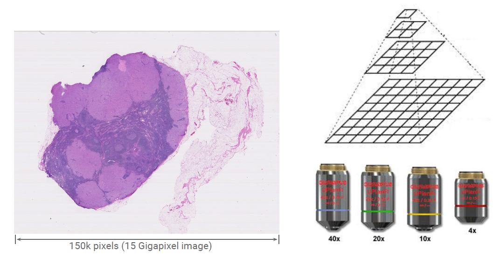

# Cancer Detection

>Applied Deep Learning Final Project
Zihe Wang, zw2624@columbia.edu

**Objectives**
------------

**Dataset**
------------
The dataset contains slides and tumor masks from the [CAMELYON16](https://camelyon17.grand-challenge.org/Data/) dataset. 

In total, I used 18 slides: 13 for training, 2 for validation and 3 for testing.

**Approach**
------------

**Model**
------------

**Result**
------------

